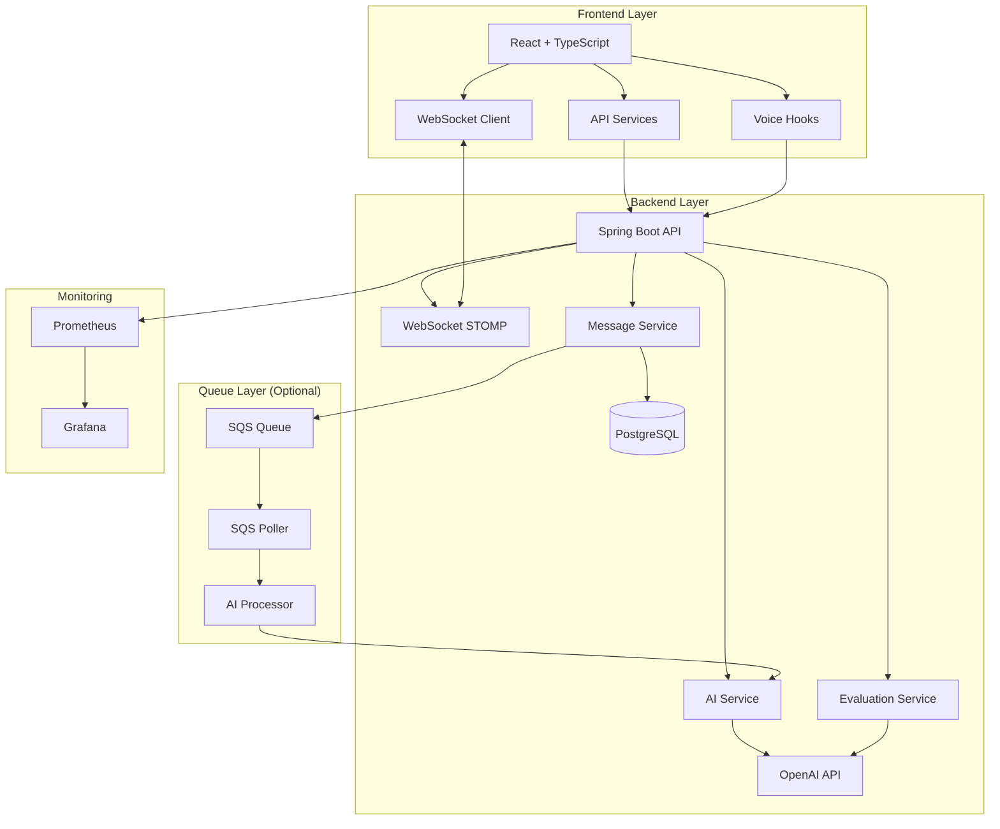
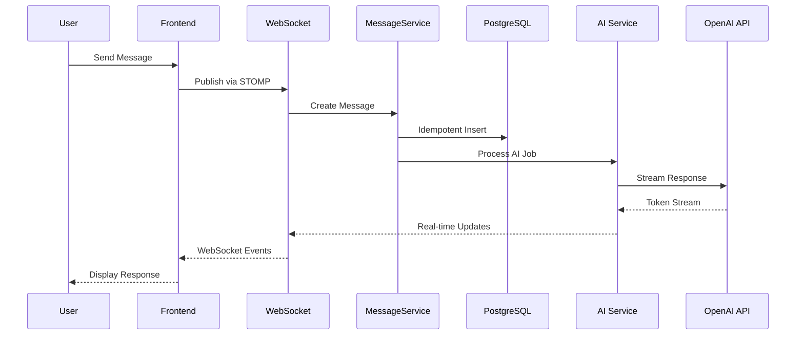
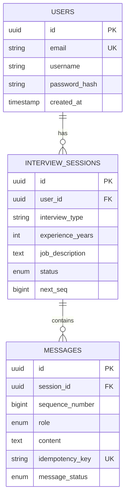

# 🎯 MiraiPrep - AI-Powered Mock Interview Platform

<div align="center">


**A production-ready, full-stack AI interview platform with real-time streaming, voice interaction, and intelligent evaluation**

[Features](#-key-features) • [Architecture](#-architecture) • [Tech Stack](#-tech-stack) • [Quick Start](#-quick-start) • [Performance](#-performance-metrics)

</div>

---

## 🚀 Overview

**MiraiPrep** is an enterprise-grade mock interview platform that leverages **OpenAI GPT-4o-mini** to provide realistic, adaptive interview experiences. The platform features real-time AI responses, voice-to-voice interaction, comprehensive performance evaluation, and scalable architecture designed for production deployment.

### 💡 What Makes This Special

- **Real-time AI Streaming**: Sub-second time-to-first-token (TTFT) with optimized message handling
- **Voice Interaction**: Seamless speech-to-text and text-to-speech integration
- **Adaptive Interviewing**: Questions dynamically adjust based on experience level (junior to staff+)
- **Production-Ready**: Idempotent message handling, pessimistic locking, and comprehensive error handling
- **Enterprise Monitoring**: Prometheus metrics, Grafana dashboards, and distributed tracing ready

---

## ✨ Key Features

### 🎤 Real-Time Voice Interaction
- **Speech-to-Text**: Web Speech API + OpenAI Whisper support
- **Text-to-Speech**: OpenAI TTS with seamless audio queuing
- **Camera Integration**: Video preview for realistic interview experience
- **Voice Speed Control**: Adjustable speaking rate for user preference

### 🤖 Intelligent AI Interviewer
- **Adaptive Difficulty**: Questions adjust based on years of experience
- **Multiple Interview Types**: Technical, Behavioral, System Design, OOP, Spring Boot, JavaScript/React, Fullstack
- **Job Description Integration**: Tailored questions based on specific role requirements
- **Topic Variety**: Ensures diverse questions, avoiding repetition

### 📊 Performance Evaluation
- **AI-Powered Scoring**: Evaluates knowledge, communication, problem-solving, and technical depth
- **Detailed Feedback**: Strengths, areas for improvement, and actionable recommendations
- **Performance History**: Track progress across multiple interview sessions
- **Category Breakdown**: Granular scoring across 4 key dimensions

### 🔒 Enterprise-Grade Reliability
- **Idempotent Operations**: Prevents duplicate messages on retries
- **Pessimistic Locking**: Ensures message ordering under concurrent requests
- **Transaction Management**: Optimized DB transactions for high throughput
- **Error Handling**: Comprehensive error recovery and user feedback

---

## 🏗️ Architecture

### System Architecture



### Request Flow



### Database Schema



---

## 🛠️ Tech Stack

### Backend
- **Framework**: Spring Boot 3.5.9 (Java 21)
- **AI Integration**: Spring AI 1.1.2 with OpenAI GPT-4o-mini
- **Database**: PostgreSQL 15 with Flyway migrations
- **Real-time**: WebSocket (STOMP) for bidirectional communication
- **Queue**: AWS SQS (optional, with local fallback)
- **Security**: JWT authentication, Spring Security
- **Monitoring**: Micrometer, Prometheus, Grafana
- **Testing**: JUnit 5, Mockito, Testcontainers

### Frontend
- **Framework**: React 18 with TypeScript
- **Build Tool**: Vite
- **UI Library**: shadcn/ui components
- **Styling**: Tailwind CSS
- **State Management**: React Context API
- **Real-time**: STOMP.js for WebSocket
- **Voice**: Web Speech API + OpenAI APIs

### Infrastructure
- **Containerization**: Docker & Docker Compose
- **Database**: PostgreSQL (local) / AWS RDS (production)
- **Deployment**: Ready for ECS Fargate / Kubernetes
- **Monitoring**: Prometheus + Grafana stack

---

## 🎨 Design Patterns & Best Practices

### Backend Patterns
- **Strategy Pattern**: Interview type handling (`InterviewStrategy`)
- **Adapter Pattern**: TTS provider abstraction (`TtsProvider`)
- **Repository Pattern**: Data access layer (Spring Data JPA)
- **Service Layer Pattern**: Business logic separation
- **Factory Pattern**: Spring `@Bean` configuration
- **Observer Pattern**: Spring Events for async processing

### Key Implementations
- **Idempotency**: Client-provided keys prevent duplicate operations
- **Pessimistic Locking**: `SELECT ... FOR UPDATE` ensures message ordering
- **Transaction Boundaries**: Short transactions, no DB locks during AI calls
- **Connection Pooling**: Optimized HTTP client for OpenAI API
- **Message History Limiting**: Last 20 messages for optimal performance

---

## 📈 Performance Metrics

### Time-to-First-Token (TTFT)
- **P50 (Median)**: ~738ms
- **P95**: ~2.06s
- **P99**: ~2.13s

### Optimizations Applied
- ✅ Native message format (no string concatenation)
- ✅ Conversation history limiting (20 messages)
- ✅ HTTP connection pooling (15 idle connections)
- ✅ Accurate TTFT measurement (excludes DB overhead)

### Scalability
- **Concurrent Users**: Designed for horizontal scaling
- **Message Throughput**: Optimized for high-volume sessions
- **Database**: Connection pooling with HikariCP
- **Queue Processing**: SQS with 100ms polling interval

---

## 🚀 Quick Start

### Prerequisites
- Java 21
- Node.js 18+
- Docker & Docker Compose
- Maven 3.8+

### Option 1: Docker Compose (Recommended)

```bash
# Start all services
docker-compose up -d

# View logs
docker-compose logs -f

# Access the application
# Frontend: http://localhost:5173
# Backend: http://localhost:8080
```

### Option 2: Local Development

```bash
# 1. Start PostgreSQL
docker-compose up -d postgres

# 2. Start Backend
cd backend
mvn spring-boot:run

# 3. Start Frontend
cd frontend
npm install
npm run dev
```

### Environment Variables

**Backend** (`application.properties`):
```properties
spring.ai.openai.api-key=${SPRING_AI_OPENAI_API_KEY}
spring.datasource.url=jdbc:postgresql://localhost:5432/aimock
```

**Frontend** (`.env`):
```env
VITE_API_URL=http://localhost:8080
```

---

## 📁 Project Structure

```
aiinter/
├── backend/                    # Spring Boot Backend
│   ├── src/main/java/
│   │   └── com/example/aimock/
│   │       ├── ai/             # AI services & strategies
│   │       ├── auth/           # JWT authentication
│   │       ├── messages/       # Message handling
│   │       ├── session/        # Interview sessions
│   │       ├── speech/         # TTS/STT providers
│   │       ├── sqs/            # Queue processing
│   │       └── websocket/       # WebSocket handlers
│   ├── src/main/resources/
│   │   └── db/migration/       # Flyway migrations
│   └── src/test/               # Comprehensive test suite
│
├── frontend/                    # React Frontend
│   ├── src/
│   │   ├── components/         # Reusable UI components
│   │   ├── hooks/              # Custom React hooks
│   │   ├── pages/              # Page components
│   │   ├── services/           # API integration
│   │   └── contexts/           # React contexts
│   └── public/                 # Static assets
│
├── monitoring/                  # Observability
│   ├── prometheus/             # Metrics configuration
│   └── grafana/                # Dashboard definitions
│
└── docker-compose.yml          # Local development setup
```

---

## 🧪 Testing

### Run All Tests
```bash
cd backend
mvn test
```

### Test Coverage
- **Unit Tests**: Service layer, repositories, utilities
- **Integration Tests**: API endpoints, WebSocket handlers
- **Coverage**: JaCoCo reports available in `target/site/jacoco/`

### Key Test Files
- `AIChatServiceTest` - AI service logic
- `AIMessageProcessorTest` - Message processing
- `MessageServiceTest` - Idempotency & concurrency
- `*IntegrationTest` - End-to-end API tests

---

## 📊 Monitoring & Observability

### Metrics (Prometheus)
- `ai_time_to_first_token` - TTFT percentiles
- `ai_response_duration` - Total AI processing time
- `ai_processing_success/failure` - Success rates
- `websocket_messages_sent` - Real-time message count

### Dashboards (Grafana)
- AI performance metrics
- Request latency tracking
- Error rate monitoring
- System health overview

---

## 🔐 Security Features

- **JWT Authentication**: Stateless token-based auth
- **Password Hashing**: BCrypt with salt
- **CORS Configuration**: Restricted origins
- **SQL Injection Prevention**: Parameterized queries (JPA)
- **Input Validation**: Bean validation annotations
- **Idempotency Keys**: Prevent duplicate operations

---

## 🚢 Deployment

### Production Considerations
- **Database**: AWS RDS PostgreSQL with SSL
- **Queue**: AWS SQS for async processing
- **Container**: Docker images for ECS/Kubernetes
- **Monitoring**: Prometheus + Grafana stack
- **Secrets**: Environment variables / AWS Secrets Manager

### Environment Profiles
- `application.properties` - Default/local
- `application-docker.properties` - Docker Compose
- `application-rds.properties` - AWS RDS production

---

## 📚 API Documentation

### Authentication
- `POST /api/auth/register` - User registration
- `POST /api/auth/login` - User login
- `GET /api/auth/me` - Current user info

### Interview Sessions
- `POST /api/v1/sessions` - Create session
- `GET /api/v1/sessions` - List sessions (paginated)
- `GET /api/v1/sessions/{id}` - Get session details
- `POST /api/v1/sessions/{id}/complete` - End interview
- `POST /api/v1/sessions/{id}/evaluate` - Get evaluation

### Messages
- `GET /api/v1/sessions/{id}/messages` - Get message history
- WebSocket: `/app/interview/send` - Send message
- WebSocket: `/topic/session/{id}` - Receive updates

### Speech
- `POST /api/v1/speech/text-to-speech` - Generate audio
- `POST /api/v1/speech/speech-to-text` - Transcribe audio

---

## 🤝 Contributing

This is a personal project, but suggestions and feedback are welcome!

---

## 📄 License

See [LICENSE](LICENSE) file for details.

---

## 🎯 Key Achievements

- ✅ **Production-Ready**: Enterprise patterns, error handling, monitoring
- ✅ **High Performance**: Optimized TTFT, connection pooling, efficient queries
- ✅ **Scalable Architecture**: Horizontal scaling, queue-based processing
- ✅ **Comprehensive Testing**: Unit, integration, and coverage reports
- ✅ **Modern Stack**: Latest Spring Boot, React, TypeScript, Java 21
- ✅ **Real-time Features**: WebSocket streaming, voice interaction
- ✅ **AI Integration**: Adaptive interviewing with OpenAI GPT-4o-mini

---

## 📄 License

This project is licensed under the MIT License - see the [LICENSE](LICENSE) file for details.

```
MIT License

Copyright (c) 2026 AlejandroPosadaR

Permission is hereby granted, free of charge, to any person obtaining a copy
of this software and associated documentation files (the "Software"), to deal
in the Software without restriction, including without limitation the rights
to use, copy, modify, merge, publish, distribute, sublicense, and/or sell
copies of the Software, and to permit persons to whom the Software is
furnished to do so, subject to the following conditions:

The above copyright notice and this permission notice shall be included in all
copies or substantial portions of the Software.

THE SOFTWARE IS PROVIDED "AS IS", WITHOUT WARRANTY OF ANY KIND, EXPRESS OR
IMPLIED, INCLUDING BUT NOT LIMITED TO THE WARRANTIES OF MERCHANTABILITY,
FITNESS FOR A PARTICULAR PURPOSE AND NONINFRINGEMENT. IN NO EVENT SHALL THE
AUTHORS OR COPYRIGHT HOLDERS BE LIABLE FOR ANY CLAIM, DAMAGES OR OTHER
LIABILITY, WHETHER IN AN ACTION OF CONTRACT, TORT OR OTHERWISE, ARISING FROM,
OUT OF OR IN CONNECTION WITH THE SOFTWARE OR THE USE OR OTHER DEALINGS IN THE
SOFTWARE.
```

---

<div align="center">

**Built with ❤️ using Spring Boot, React, and OpenAI**

[Report Bug](https://github.com/yourusername/miraiprep/issues) • [Request Feature](https://github.com/yourusername/miraiprep/issues)

</div>
