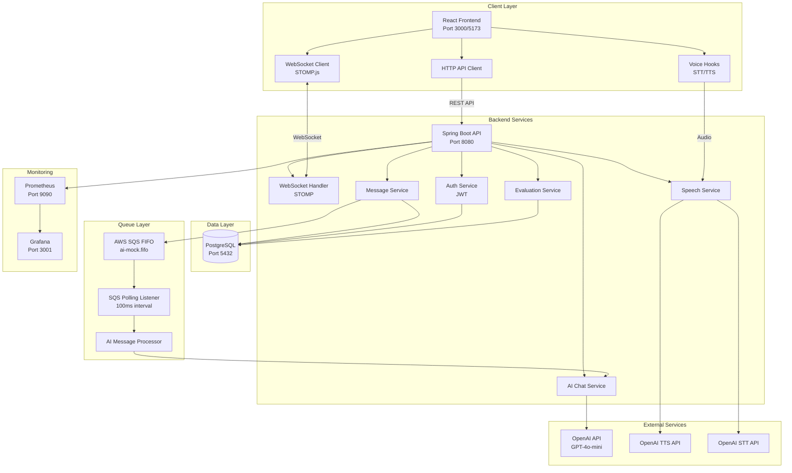
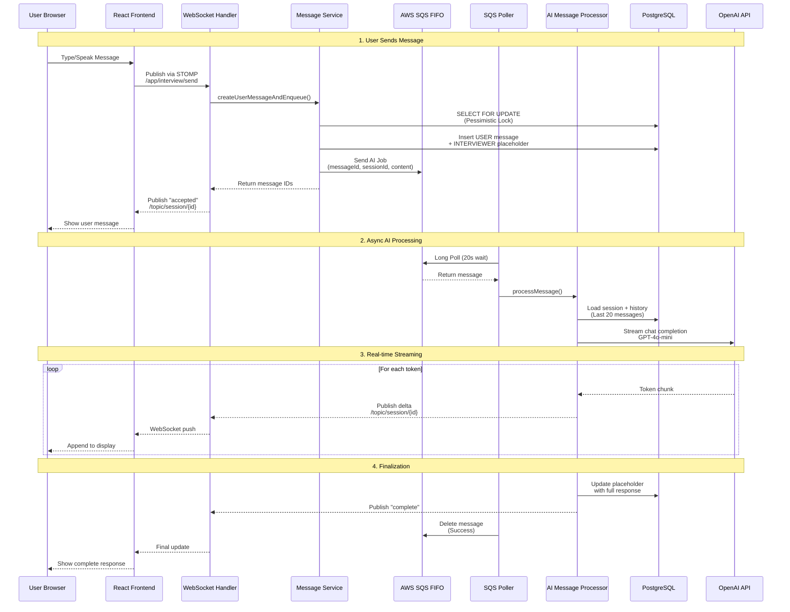
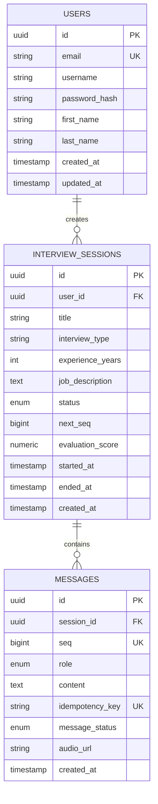
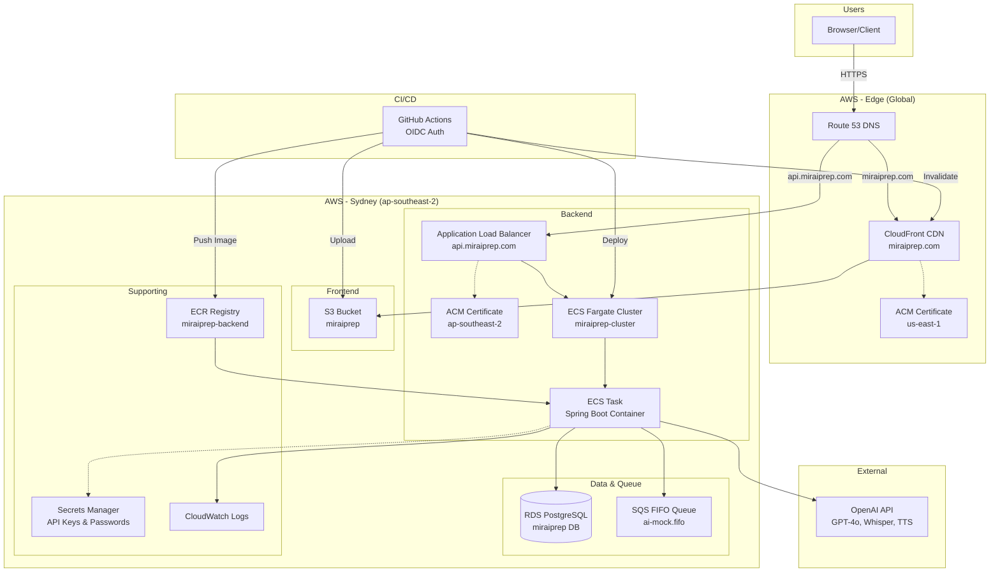

# 🎯 MiraiPrep - AI-Powered Mock Interview Platform

<div align="center">


**A production-ready, full-stack AI interview platform with real-time streaming, voice interaction, and intelligent evaluation**

[Features](#-key-features) • [Architecture](#-architecture) • [Quick Start](#-quick-start) • [Performance](#-performance-metrics)

</div>

---

## 🚀 Overview

**MiraiPrep** is an enterprise-grade mock interview platform that leverages **OpenAI GPT-4o-mini** to provide realistic, adaptive interview experiences. The platform features real-time AI responses, voice-to-voice interaction, comprehensive performance evaluation, and scalable architecture designed for production deployment.

### 💡 What Makes This Special

- **Real-time AI Streaming**: Sub-second time-to-first-token (TTFT) with optimized message handling
- **Voice Interaction**: Seamless speech-to-text and text-to-speech integration
- **Adaptive Interviewing**: Questions dynamically adjust based on experience level (junior to staff+)
- **Production-Ready**: Idempotent message handling, pessimistic locking, and comprehensive error handling
- **Enterprise Monitoring**: Prometheus metrics, Grafana dashboards, and distributed tracing ready

---

## ✨ Key Features

### 🎤 Real-Time Voice Interaction
- **Speech-to-Text**: Web Speech API + OpenAI Whisper support
- **Text-to-Speech**: OpenAI TTS with seamless audio queuing
- **Camera Integration**: Video preview for realistic interview experience
- **Voice Speed Control**: Adjustable speaking rate for user preference

### 🤖 Intelligent AI Interviewer
- **Adaptive Difficulty**: Questions adjust based on years of experience
- **Multiple Interview Types**: Technical, Behavioral, System Design, OOP, Spring Boot, JavaScript/React, Fullstack
- **Job Description Integration**: Tailored questions based on specific role requirements
- **Topic Variety**: Ensures diverse questions, avoiding repetition

### 📊 Performance Evaluation
- **AI-Powered Scoring**: Evaluates knowledge, communication, problem-solving, and technical depth
- **Detailed Feedback**: Strengths, areas for improvement, and actionable recommendations
- **Performance History**: Track progress across multiple interview sessions
- **Category Breakdown**: Granular scoring across 4 key dimensions

### 🔒 Enterprise-Grade Reliability
- **Idempotent Operations**: Prevents duplicate messages on retries
- **Pessimistic Locking**: Ensures message ordering under concurrent requests
- **Transaction Management**: Optimized DB transactions for high throughput
- **Error Handling**: Comprehensive error recovery and user feedback

---

## 🏗️ Architecture

### AWS Production Architecture

```
┌─────────────────────────────────────────────────────────────────────────────────────┐
│                                    AWS Cloud                                         │
│                                                                                      │
│  ┌─────────────────────────────────────────────────────────────────────────────┐   │
│  │                              Route 53 DNS                                    │   │
│  │                   miraiprep.com → CloudFront                                │   │
│  │                   api.miraiprep.com → ALB                                   │   │
│  └─────────────────────────────────────────────────────────────────────────────┘   │
│                                      │                                               │
│              ┌───────────────────────┴───────────────────────┐                      │
│              ▼                                               ▼                       │
│  ┌───────────────────────────┐               ┌──────────────────────────────────┐  │
│  │      CloudFront CDN       │               │   Application Load Balancer      │  │
│  │   (miraiprep.com)         │               │   (api.miraiprep.com)            │  │
│  │   + ACM Certificate       │               │   + ACM Certificate (Sydney)     │  │
│  └───────────┬───────────────┘               └──────────────┬───────────────────┘  │
│              │                                              │                        │
│              ▼                                              ▼                        │
│  ┌───────────────────────────┐               ┌──────────────────────────────────┐  │
│  │        S3 Bucket          │               │         ECS Fargate              │  │
│  │   (miraiprep)             │               │   ┌──────────────────────────┐   │  │
│  │   React SPA Static Files  │               │   │   Spring Boot Container  │   │  │
│  └───────────────────────────┘               │   │   ┌──────────────────┐   │   │  │
│                                              │   │   │ REST Controllers │   │   │  │
│                                              │   │   │ (Auth, Session,  │   │   │  │
│                                              │   │   │  Message, Speech)│   │   │  │
│                                              │   │   └────────┬─────────┘   │   │  │
│                                              │   │            │             │   │  │
│                                              │   │   ┌────────▼─────────┐   │   │  │
│                                              │   │   │ WebSocket/STOMP  │   │   │  │
│                                              │   │   │ (Real-time)      │   │   │  │
│                                              │   │   └────────┬─────────┘   │   │  │
│                                              │   │            │             │   │  │
│                                              │   │   ┌────────▼─────────┐   │   │  │
│                                              │   │   │ Message Service  │───┼───┼──┼──► SQS FIFO
│                                              │   │   │ (Queue Jobs)     │   │   │  │   (ai-mock.fifo)
│                                              │   │   └──────────────────┘   │   │  │       │
│                                              │   │                          │   │  │       │
│                                              │   │   ┌──────────────────┐   │   │  │       │
│                                              │   │   │ SQS Poller       │◄──┼───┼──┼───────┘
│                                              │   │   │ (AI Worker)      │   │   │  │
│                                              │   │   └────────┬─────────┘   │   │  │
│                                              │   │            │             │   │  │
│                                              │   │   ┌────────▼─────────┐   │   │  │
│                                              │   │   │ AI Chat Service  │───┼───┼──┼──► OpenAI API
│                                              │   │   │ (GPT-4o-mini)    │   │   │  │   (Chat, TTS, STT)
│                                              │   │   └────────┬─────────┘   │   │  │
│                                              │   │            │             │   │  │
│                                              │   │   ┌────────▼─────────┐   │   │  │
│                                              │   │   │ JPA Repository   │   │   │  │
│                                              │   │   └────────┬─────────┘   │   │  │
│                                              │   └────────────┼─────────────┘   │  │
│                                              └────────────────┼─────────────────┘  │
│                                                               │                     │
│                                                               ▼                     │
│                                              ┌──────────────────────────────────┐  │
│                                              │       RDS PostgreSQL             │  │
│                                              │   (miraiprep.*.rds.amazonaws.com)│  │
│                                              │   + SSL/TLS Encryption           │  │
│                                              └──────────────────────────────────┘  │
│                                                                                      │
│  ┌─────────────────────────────────────────────────────────────────────────────┐   │
│  │                           Supporting Services                                │   │
│  │                                                                              │   │
│  │  ┌─────────────┐  ┌─────────────┐  ┌─────────────┐  ┌─────────────────────┐ │   │
│  │  │    ECR      │  │  Secrets    │  │ CloudWatch  │  │      IAM Roles      │ │   │
│  │  │ (Docker     │  │  Manager    │  │   Logs      │  │ (ECS Task Execution │ │   │
│  │  │  Registry)  │  │ (API Keys,  │  │ (/ecs/      │  │  + Task Role)       │ │   │
│  │  │             │  │  DB Pass)   │  │  miraiprep) │  │                     │ │   │
│  │  └─────────────┘  └─────────────┘  └─────────────┘  └─────────────────────┘ │   │
│  └─────────────────────────────────────────────────────────────────────────────┘   │
│                                                                                      │
└─────────────────────────────────────────────────────────────────────────────────────┘

┌─────────────────────────────────────────────────────────────────────────────────────┐
│                              GitHub Actions CI/CD                                    │
│                                                                                      │
│  ┌──────────────┐    ┌──────────────┐    ┌──────────────┐    ┌──────────────────┐  │
│  │   On Push    │───►│ Build Docker │───►│ Push to ECR  │───►│ Deploy to ECS    │  │
│  │  (main)      │    │   Image      │    │              │    │ (Force New       │  │
│  │              │    │              │    │              │    │  Deployment)     │  │
│  └──────────────┘    └──────────────┘    └──────────────┘    └──────────────────┘  │
│                                                                                      │
│  ┌──────────────┐    ┌──────────────┐    ┌──────────────┐    ┌──────────────────┐  │
│  │   On Push    │───►│ npm run     │───►│ Upload to S3 │───►│ Invalidate       │  │
│  │  (main)      │    │   build     │    │              │    │ CloudFront Cache │  │
│  └──────────────┘    └──────────────┘    └──────────────┘    └──────────────────┘  │
│                                                                                      │
│  Authentication: OIDC (OpenID Connect) - No long-lived AWS credentials             │
└─────────────────────────────────────────────────────────────────────────────────────┘
```

### System Architecture (Application Level)



### Complete Request Flow (with SQS)



### Backend Component Flow

```
┌─────────────────────────────────────────────────────────────────────────────┐
│                        Spring Boot Application                               │
├─────────────────────────────────────────────────────────────────────────────┤
│                                                                              │
│   HTTP/REST Endpoints                    WebSocket Endpoints                 │
│   ┌─────────────────────┐                ┌─────────────────────┐            │
│   │ AuthController      │                │ InterviewStomp      │            │
│   │ /api/auth/*         │                │ Controller          │            │
│   ├─────────────────────┤                │ /app/interview/*    │            │
│   │ InterviewSession    │                └──────────┬──────────┘            │
│   │ Controller          │                           │                        │
│   │ /api/v1/sessions/*  │                           │                        │
│   ├─────────────────────┤                           ▼                        │
│   │ MessageController   │                ┌─────────────────────┐            │
│   │ /api/v1/messages/*  │                │   MessageService    │            │
│   ├─────────────────────┤                │ (Idempotent +       │            │
│   │ SpeechController    │───────────────►│  Pessimistic Lock)  │            │
│   │ /api/v1/speech/*    │                └──────────┬──────────┘            │
│   └─────────────────────┘                           │                        │
│            │                                        │                        │
│            ▼                                        ▼                        │
│   ┌─────────────────────┐                ┌─────────────────────┐            │
│   │   SpeechService     │                │    SQSService       │            │
│   │ (OpenAI TTS/STT)    │                │ (RealSQSService or  │            │
│   └─────────────────────┘                │  NoOpSQSService)    │            │
│                                          └──────────┬──────────┘            │
│                                                     │                        │
│                                                     ▼                        │
│                                          ┌─────────────────────┐            │
│                                          │  AWS SQS FIFO       │            │
│                                          │  (ai-mock.fifo)     │            │
│                                          └──────────┬──────────┘            │
│                                                     │                        │
│                                                     ▼                        │
│   ┌─────────────────────────────────────────────────────────────────┐       │
│   │                    SqsPollingListener                            │       │
│   │  @Scheduled(fixedDelay=100ms) - polls SQS with 20s long polling │       │
│   └───────────────────────────────┬─────────────────────────────────┘       │
│                                   │                                          │
│                                   ▼                                          │
│   ┌─────────────────────────────────────────────────────────────────┐       │
│   │                    AIMessageProcessor                            │       │
│   │  1. prepareForStreaming() - short TX, mark as STREAMING         │       │
│   │  2. streamAiResponse()    - NO TX, stream tokens to WebSocket   │       │
│   │  3. saveSuccessResult()   - short TX, save final response       │       │
│   └───────────────────────────────┬─────────────────────────────────┘       │
│                                   │                                          │
│                                   ▼                                          │
│   ┌─────────────────────────────────────────────────────────────────┐       │
│   │                    AIChatService                                 │       │
│   │  - Builds prompt with interview strategy                         │       │
│   │  - Calls OpenAI GPT-4o-mini with streaming                      │       │
│   │  - Publishes token deltas via SessionTopicPublisher             │       │
│   └─────────────────────────────────────────────────────────────────┘       │
│                                                                              │
└─────────────────────────────────────────────────────────────────────────────┘
```

### Database Schema



### AWS Infrastructure Summary

| Component | AWS Service | Configuration |
|-----------|-------------|---------------|
| **Frontend Hosting** | S3 + CloudFront | Static website, CDN, HTTPS |
| **Frontend Domain** | Route 53 + ACM | `miraiprep.com` (us-east-1 cert) |
| **Backend Runtime** | ECS Fargate | 1 vCPU, 2GB RAM, auto-scaling |
| **Backend Domain** | Route 53 + ACM | `api.miraiprep.com` (ap-southeast-2 cert) |
| **Load Balancer** | ALB | HTTP/HTTPS, WebSocket support |
| **Database** | RDS PostgreSQL | Multi-AZ capable, SSL required |
| **Message Queue** | SQS FIFO | `ai-mock.fifo`, exactly-once processing |
| **Container Registry** | ECR | `miraiprep-backend` repository |
| **Secrets** | Secrets Manager | OpenAI API key, DB password |
| **Logs** | CloudWatch | `/ecs/miraiprep-backend` log group |
| **CI/CD Auth** | IAM + OIDC | GitHub Actions role, no long-lived keys |

### Deployment Architecture (Mermaid)



---

## 🚀 Quick Start

### Prerequisites

- **Docker** & **Docker Compose** (recommended)
- **Java 21** (if running backend locally)
- **Node.js 20+** (if running frontend locally)
- **Maven 3.8+** (if running backend locally)
- **OpenAI API Key** (required for AI features)

### Option 1: Docker Compose (Easiest - Recommended)

**One command to start everything:**

```bash
# Clone the repository
git clone <your-repo-url>
cd aiinter

# Create .env file with your OpenAI API key
echo "SPRING_AI_OPENAI_API_KEY=your-openai-api-key-here" > .env

# Start all services
docker-compose up -d

# Check services are running
docker-compose ps
```

**Access the application:**
- 🌐 **Frontend**: http://localhost:3000
- 🔧 **Backend API**: http://localhost:8080
- 📊 **Grafana**: http://localhost:3001 (admin/admin)
- 📈 **Prometheus**: http://localhost:9090

**View logs:**
```bash
# All services
docker-compose logs -f

# Specific service
docker-compose logs -f backend
docker-compose logs -f frontend
```

**Stop services:**
```bash
docker-compose down
```

### Option 2: Local Development (For Development)

**Step 1: Start Database**
```bash
# Start only PostgreSQL
docker-compose up -d postgres

# Verify it's running
docker-compose ps postgres
```

**Step 2: Start Backend**
```bash
cd backend

# Set environment variable
export SPRING_AI_OPENAI_API_KEY=your-openai-api-key-here

# Run Spring Boot
mvn spring-boot:run

# Backend will be available at http://localhost:8080
```

**Step 3: Start Frontend**
```bash
# In a new terminal
cd frontend

# Install dependencies
npm install

# Start dev server
npm run dev

# Frontend will be available at http://localhost:5173
```

### Environment Variables

**Required for Backend:**
```bash
# OpenAI API Key (required)
SPRING_AI_OPENAI_API_KEY=sk-proj-...

# Database (optional - defaults to local Docker postgres)
DATABASE_URL=jdbc:postgresql://localhost:5432/aimock
DATABASE_USERNAME=postgres
DATABASE_PASSWORD=postgres

# SQS (optional - defaults to disabled)
SQS_QUEUE_URL=https://sqs.region.amazonaws.com/account/queue-name
APP_SQS_ENABLED=true
```

**Required for Frontend:**
```bash
# Create frontend/.env file
VITE_API_URL=http://localhost:8080
VITE_WS_URL=ws://localhost:8080
```

### Verify Installation

1. **Check Backend Health:**
   ```bash
   curl http://localhost:8080/actuator/health
   # Should return: {"status":"UP"}
   ```

2. **Check Frontend:**
   - Open http://localhost:3000 (Docker) or http://localhost:5173 (local)
   - You should see the MiraiPrep landing page

3. **Check Database:**
   ```bash
   docker-compose exec postgres psql -U postgres -d aimock -c "\dt"
   # Should list tables: users, interview_sessions, messages
   ```

---

## 🛠️ Tech Stack

### Backend
- **Framework**: Spring Boot 3.5.9 (Java 21)
- **AI Integration**: Spring AI 1.1.2 with OpenAI GPT-4o-mini
- **Database**: PostgreSQL 16 with Flyway migrations
- **Real-time**: WebSocket (STOMP) for bidirectional communication
- **Queue**: AWS SQS (optional, with local fallback)
- **Security**: JWT authentication, Spring Security
- **Monitoring**: Micrometer, Prometheus, Grafana
- **Testing**: JUnit 5, Mockito, Testcontainers

### Frontend
- **Framework**: React 18 with TypeScript
- **Build Tool**: Vite 5.4
- **UI Library**: shadcn/ui components (Radix UI)
- **Styling**: Tailwind CSS
- **State Management**: React Context API
- **Real-time**: STOMP.js for WebSocket
- **Voice**: Web Speech API + OpenAI APIs
- **Routing**: React Router v6

### Infrastructure
- **Containerization**: Docker & Docker Compose
- **Database**: PostgreSQL 16 (local) / AWS RDS (production)
- **Deployment**: ECS Fargate / S3 + CloudFront
- **Monitoring**: Prometheus + Grafana stack
- **CI/CD**: GitHub Actions

---

## 🎨 Design Patterns & Best Practices

### Backend Patterns
- **Strategy Pattern**: Interview type handling (`InterviewStrategy`)
- **Adapter Pattern**: TTS provider abstraction (`TtsProvider`)
- **Repository Pattern**: Data access layer (Spring Data JPA)
- **Service Layer Pattern**: Business logic separation
- **Factory Pattern**: Spring `@Bean` configuration
- **Observer Pattern**: Spring Events for async processing

### Key Implementations
- **Idempotency**: Client-provided keys prevent duplicate operations
- **Pessimistic Locking**: `SELECT ... FOR UPDATE` ensures message ordering
- **Transaction Boundaries**: Short transactions, no DB locks during AI calls
- **Connection Pooling**: Optimized HTTP client for OpenAI API (15 idle connections)
- **Message History Limiting**: Last 20 messages for optimal performance

---

## 📈 Performance Metrics

### Time-to-First-Token (TTFT)
- **P50 (Median)**: ~738ms
- **P95**: ~2.06s
- **P99**: ~2.13s

### Optimizations Applied
- ✅ Native message format (no string concatenation)
- ✅ Conversation history limiting (20 messages)
- ✅ HTTP connection pooling (15 idle connections)
- ✅ Accurate TTFT measurement (excludes DB overhead)
- ✅ SQS long polling (20s wait, 100ms poll interval)

### Scalability
- **Concurrent Users**: Designed for horizontal scaling
- **Message Throughput**: Optimized for high-volume sessions
- **Database**: Connection pooling with HikariCP (10 max connections)
- **Queue Processing**: SQS with 100ms polling interval

---

## 📁 Project Structure

```
aiinter/
├── backend/                    # Spring Boot Backend
│   ├── src/main/java/
│   │   └── com/example/aimock/
│   │       ├── ai/             # AI services & strategies
│   │       ├── auth/           # JWT authentication
│   │       ├── messages/       # Message handling
│   │       ├── session/        # Interview sessions
│   │       ├── speech/         # TTS/STT providers
│   │       ├── sqs/            # Queue processing
│   │       └── websocket/       # WebSocket handlers
│   ├── src/main/resources/
│   │   └── db/migration/       # Flyway migrations
│   └── src/test/               # Comprehensive test suite
│
├── frontend/                    # React Frontend
│   ├── src/
│   │   ├── components/         # Reusable UI components
│   │   ├── hooks/              # Custom React hooks
│   │   ├── pages/              # Page components
│   │   ├── services/           # API integration
│   │   └── contexts/           # React contexts
│   └── public/                 # Static assets
│
├── monitoring/                  # Observability
│   ├── prometheus/             # Metrics configuration
│   └── grafana/                # Dashboard definitions
│
└── docker-compose.yml          # Local development setup
```

---

## 🧪 Testing

### Run All Tests
```bash
cd backend
mvn test
```

### Run Specific Test Class
```bash
cd backend
mvn test -Dtest=AIChatServiceTest
```

### Generate Coverage Report
```bash
cd backend
mvn verify
# Report available at: backend/target/site/jacoco/index.html
```

### Test Coverage
- **Unit Tests**: Service layer, repositories, utilities
- **Integration Tests**: API endpoints, WebSocket handlers
- **Coverage**: JaCoCo reports available in `target/site/jacoco/`

### Key Test Files
- `AIChatServiceTest` - AI service logic
- `AIMessageProcessorTest` - Message processing
- `MessageServiceTest` - Idempotency & concurrency
- `*IntegrationTest` - End-to-end API tests

---

## 📊 Monitoring & Observability

### Metrics (Prometheus)
- `ai_time_to_first_token` - TTFT percentiles (P50, P95, P99)
- `ai_response_duration` - Total AI processing time
- `ai_processing_success/failure` - Success rates
- `websocket_messages_sent` - Real-time message count

### Dashboards (Grafana)
- AI performance metrics
- Request latency tracking
- Error rate monitoring
- System health overview

### Access Monitoring
- **Grafana**: http://localhost:3001 (admin/admin)
- **Prometheus**: http://localhost:9090

---

## 🔐 Security Features

- **JWT Authentication**: Stateless token-based auth
- **Password Hashing**: BCrypt with salt
- **CORS Configuration**: Restricted origins
- **SQL Injection Prevention**: Parameterized queries (JPA)
- **Input Validation**: Bean validation annotations
- **Idempotency Keys**: Prevent duplicate operations
- **Secrets Management**: AWS Secrets Manager support

---

## 🚢 Deployment

### Production Architecture
- **Frontend**: S3 + CloudFront CDN
- **Backend**: ECS Fargate with Application Load Balancer
- **Database**: AWS RDS PostgreSQL with SSL
- **Queue**: AWS SQS for async processing
- **Monitoring**: Prometheus + Grafana
- **CI/CD**: GitHub Actions with OIDC

### Environment Profiles
- `application.properties` - Default/local
- `application-docker.properties` - Docker Compose
- `application-rds.properties` - AWS RDS production

### Deployment Documentation
See `.github/` directory for:
- CI/CD setup (`workflows/ci.yml`, `workflows/deploy.yml`)
- AWS resource setup guides
- Secrets management

---

## 📚 API Documentation

### Authentication
- `POST /api/auth/register` - User registration
- `POST /api/auth/login` - User login
- `GET /api/auth/me` - Current user info

### Interview Sessions
- `POST /api/v1/interview-sessions` - Create session
- `GET /api/v1/interview-sessions` - List sessions
- `GET /api/v1/interview-sessions/paginated` - Paginated list
- `GET /api/v1/interview-sessions/{id}` - Get session details
- `PUT /api/v1/interview-sessions/{id}/complete` - End interview
- `POST /api/v1/interview-sessions/{id}/evaluate` - Get evaluation

### Messages
- `GET /api/v1/sessions/{id}/messages` - Get message history
- WebSocket: `/app/interview/send` - Send message
- WebSocket: `/topic/session/{id}` - Receive updates

### Speech
- `POST /api/v1/speech/synthesize` - Generate TTS audio
- `POST /api/v1/speech/transcribe` - Transcribe audio (STT)

### Health & Metrics
- `GET /actuator/health` - Health check
- `GET /actuator/prometheus` - Prometheus metrics

---

## 🐛 Troubleshooting

### Backend won't start
```bash
# Check logs
docker-compose logs backend

# Common issues:
# - Missing SPRING_AI_OPENAI_API_KEY
# - Database not ready (wait for postgres health check)
# - Port 8080 already in use
```

### Frontend shows connection errors
```bash
# Verify backend is running
curl http://localhost:8080/actuator/health

# Check VITE_API_URL in frontend/.env
# Should be: VITE_API_URL=http://localhost:8080
```

### Database connection errors
```bash
# Check PostgreSQL is running
docker-compose ps postgres

# Check connection
docker-compose exec postgres psql -U postgres -d aimock -c "SELECT 1"
```

---

## 🤝 Contributing

This is a personal project, but suggestions and feedback are welcome!

---

## 🎯 Key Achievements

- ✅ **Production-Ready**: Enterprise patterns, error handling, monitoring
- ✅ **High Performance**: Optimized TTFT, connection pooling, efficient queries
- ✅ **Scalable Architecture**: Horizontal scaling, queue-based processing
- ✅ **Comprehensive Testing**: Unit, integration, and coverage reports
- ✅ **Modern Stack**: Latest Spring Boot, React, TypeScript, Java 21
- ✅ **Real-time Features**: WebSocket streaming, voice interaction
- ✅ **AI Integration**: Adaptive interviewing with OpenAI GPT-4o-mini

---

## 📄 License

This project is licensed under the MIT License - see the [LICENSE](LICENSE) file for details.

```
MIT License

Copyright (c) 2026 AlejandroPosadaR

Permission is hereby granted, free of charge, to any person obtaining a copy
of this software and associated documentation files (the "Software"), to deal
in the Software without restriction, including without limitation the rights
to use, copy, modify, merge, publish, distribute, sublicense, and/or sell
copies of the Software, and to permit persons to whom the Software is
furnished to do so, subject to the following conditions:

The above copyright notice and this permission notice shall be included in all
copies or substantial portions of the Software.

THE SOFTWARE IS PROVIDED "AS IS", WITHOUT WARRANTY OF ANY KIND, EXPRESS OR
IMPLIED, INCLUDING BUT NOT LIMITED TO THE WARRANTIES OF MERCHANTABILITY,
FITNESS FOR A PARTICULAR PURPOSE AND NONINFRINGEMENT. IN NO EVENT SHALL THE
AUTHORS OR COPYRIGHT HOLDERS BE LIABLE FOR ANY CLAIM, DAMAGES OR OTHER
LIABILITY, WHETHER IN AN ACTION OF CONTRACT, TORT OR OTHERWISE, ARISING FROM,
OUT OF OR IN CONNECTION WITH THE SOFTWARE OR THE USE OR OTHER DEALINGS IN THE
SOFTWARE.
```

---

<div align="center">

**Built with ❤️ using Spring Boot, React, and OpenAI**

[Report Bug](https://github.com/yourusername/miraiprep/issues) • [Request Feature](https://github.com/yourusername/miraiprep/issues)

</div>
